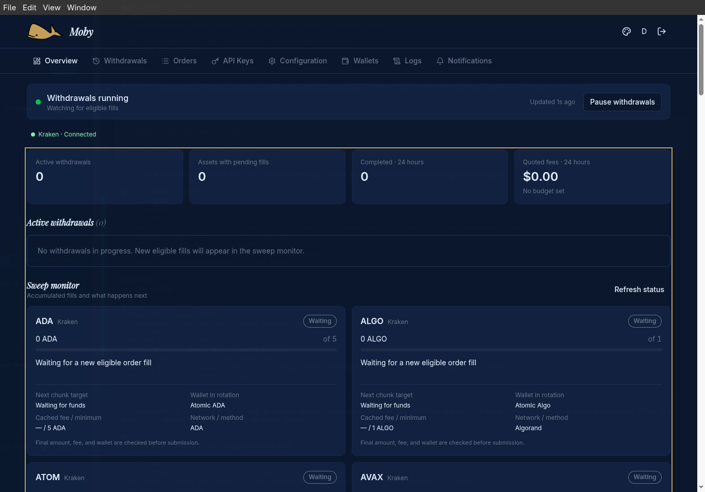

# Moby

Moby automatically withdraws cryptocurrency from your exchanges to your wallets after trades fill. Instead of manually moving funds after every trade, you choose the assets, destinations, and withdrawal rules, and Moby handles the transfers.

It runs on your own computer with a desktop dashboard for managing exchange connections, wallets, and withdrawals. Currently supported exchange: Kraken.

## How it works

1. Connect your exchange account using API credentials.
2. Choose the assets to monitor and your saved withdrawal addresses.
3. Set how much to withdraw, how much to leave on the exchange, and when transfers should happen.
4. Start Moby and follow the activity in the dashboard.

## Get started

Download a trusted desktop build from the [Godswildones/Moby releases](https://github.com/Godswildones/Moby/releases), when available, or [build it from source](docs/USER_GUIDE.md#building-from-source). On Linux, make the AppImage executable and launch it. Create your local dashboard account, then add a dedicated Kraken API key.

Enable **Query Funds**, **Query Open Orders & Trades**, **Query Closed Orders & Trades**, **Withdraw Funds**, and **WebSocket interface**. The [setup guide](docs/USER_GUIDE.md#connect-kraken) explains these permissions and how to configure destinations. Moby does not need permission to place or cancel trading orders.

Start in dry-run mode, check the destination address and network, then test a small real withdrawal and confirm receipt before increasing the amount.

## What you can do

- **Automate withdrawals:** Set thresholds, transfer sizes, reserves, and cooldowns for each asset.
- **Manage destinations:** Choose wallets and set per-wallet withdrawal caps.
- **Monitor activity:** See balances, pending amounts, transfer status, and searchable withdrawal history.
- **Control fees:** Preview estimated fees and optionally set a rolling 24-hour fee budget.
- **Stay informed:** Receive optional Telegram alerts for withdrawals, connection problems, and delays.
- **Pause and review:** Stop new withdrawals, review uncertain transfers, or clear queued amounts you no longer want to withdraw.

## Before moving funds

Start with **dry-run mode** to check your settings without sending withdrawals. Verify the destination address and network before enabling real transfers.

Moby must remain running to monitor activity and submit transfers. Pausing stops new withdrawals; transfers already submitted to an exchange can still complete. Exchange fees, minimums, and holds still apply.

## Pausing and restarting

Moby keeps a local database of queued amounts and withdrawal jobs. **Pause withdrawals** stops new submissions while fill monitoring continues. After selling or withdrawing manually, resuming checks exchange balances and reduces queued amounts that are no longer available. If you want to discard the queue altogether, stay paused and use **Clear queued amounts…** once there are no active withdrawals.

Closing Moby stops monitoring. Saved queues survive a restart, but fills from while the app was closed are not added automatically: monitoring begins with the new run. See [pause, restart, and recovery behavior](docs/USER_GUIDE.md#pause-resume-and-restart).

## Protect your backups

There are three separate secrets: the **dashboard login password**, the **wallet password** that encrypts generated wallets, and the **encryption key in `.env`** used for API credentials and Telegram settings. The `.env` key cannot unlock your wallets or replace a forgotten wallet password.

Back up `moby.db` and `.env` together after fully quitting the app, and keep the wallet password separately in a secure place. Verify wallet recovery before funding or deleting a generated wallet. See the [backup and recovery instructions](docs/USER_GUIDE.md#backups-and-recovery).
